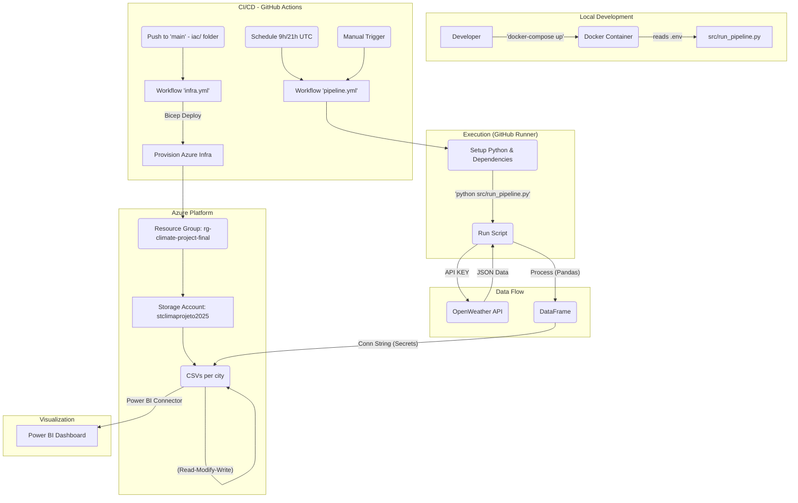
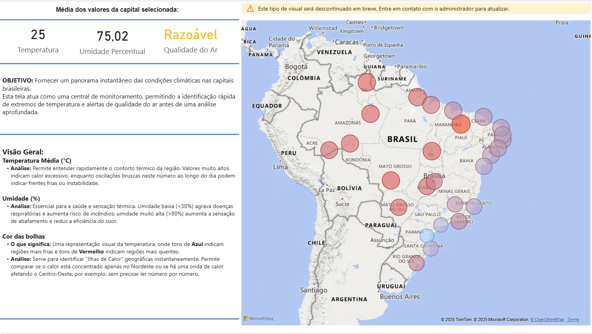
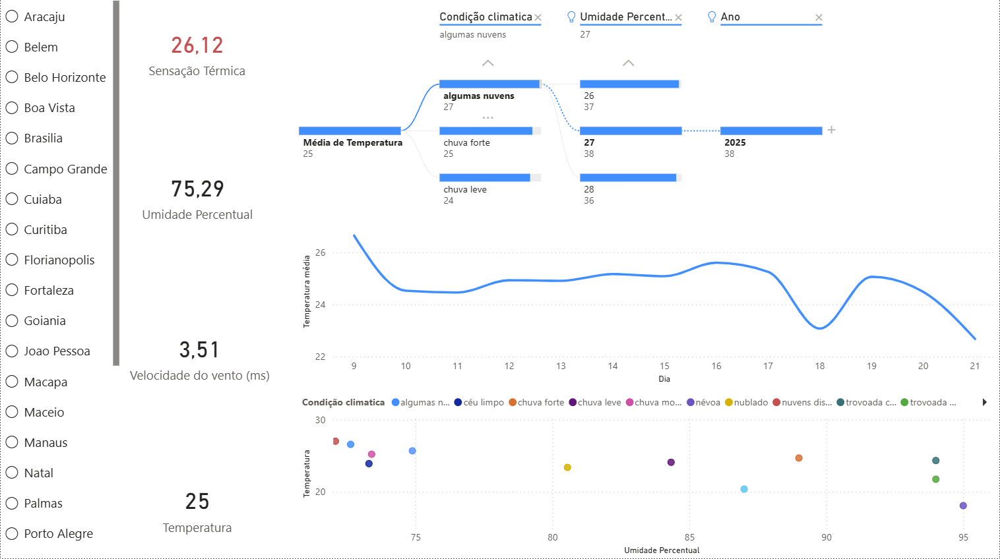
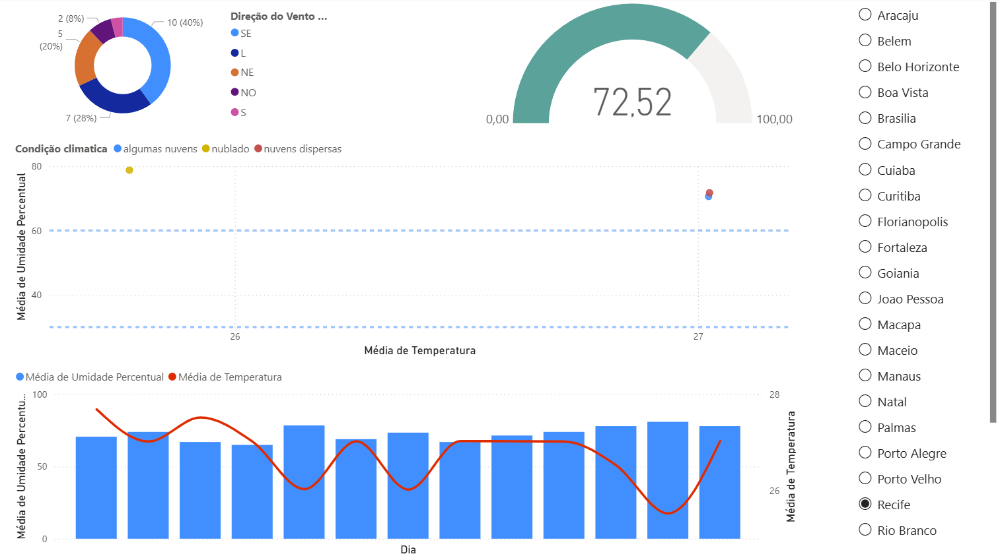
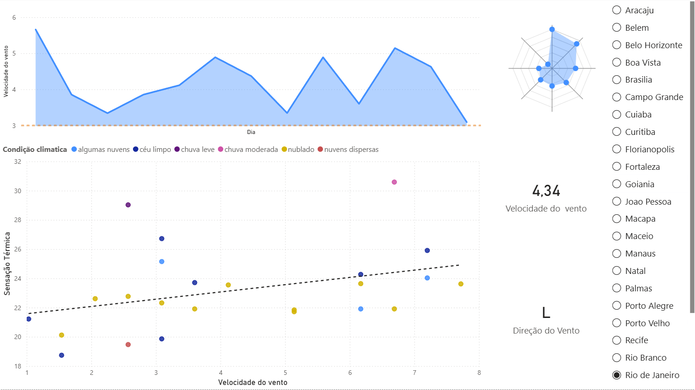
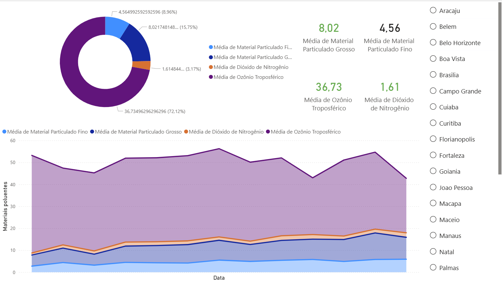

# Climate Data Analysis System - Brazilian Capitals

This project, developed for the Cloud Computing course, implements an automated data pipeline to collect, process, and store climate and air pollution data from the 27 capital cities of Brazil, using the OpenWeather API and Microsoft Azure services.

## Team

* **Student:** Maria Eduarda Pompiani — **ID:** [INSERT ID] — **Email:** maria.esapc@puccampinas.edu.br
* **Student:** Matheus Rodrigues Gomes — **ID:** [INSERT ID] — **Email:** [INSERT EMAIL]

## General Description

The objective of this system is to create a unified historical dataset of environmental conditions in Brazil's major cities. The pipeline runs automatically twice a day, collecting meteorological data (such as temperature, humidity, wind) and air quality data (such as PM2.5, NO2, O3 levels).

The data is processed and stored in **Azure Blob Storage**, ready to be consumed by visualization tools like Power BI for trend analysis, correlation studies, and generating insights into urban climate across the country.

## Dataset

* **Data Source:** [OpenWeather API](https://openweathermap.org/api), utilizing the "Current Weather Data" and "Air Pollution API" endpoints.
* **Expected Data Volume:** The pipeline is scheduled to run twice daily (09:00 and 21:00 UTC). In each run, 27 records (one for each capital) are collected and processed. The data is appended to individual CSV files per city, allowing the dataset to grow over time.
* **Licensing:** Use of the data is subject to the OpenWeather API's terms of service.

## Solution Architecture

The diagram below illustrates the system architecture, from the data pipeline orchestration and execution to storage in Azure and the future visualization layer.

## Demonstration

The analytical dashboard was developed in Microsoft Power BI, connecting directly to the processed data in Azure Blob Storage. Below are details and screenshots of the main system views:

### 1. Overview
This dashboard serves as the command center for the project, offering a geospatial view of the 27 capitals. It aggregates high-level metrics, such as current temperature averages and active alerts, enabling a quick assessment of the national climate status. It allows users to instantly identify regions with extreme conditions before diving into specific metrics.

### 2. Thermal Analysis
This section provides a deep dive into thermal data, comparing nominal temperatures against "feels like" sensations. It includes time-series charts to track diurnal temperature variations and ranking visualizations to identify the hottest and coldest cities. This analysis is essential for understanding thermal comfort, heat islands, and seasonal variations across different regions.

### 3. Humidity Monitoring
Dedicated to analyzing relative humidity percentages, this dashboard is vital for predicting precipitation and assessing dry air risks. The visualization uses color-coded indicators and threshold lines to highlight cities entering dangerous dryness levels (below 30%) or saturation points, supporting public health advisories regarding respiratory risks.

### 4. Wind Dynamics
This view offers detailed insights into wind behavior, including speed and direction data. By visualizing wind patterns, users can understand air mass movements and ventilation in urban canyons. This data is particularly useful for meteorological studies, analyzing storm patterns, and understanding the potential dispersion of atmospheric pollutants.

### 5. Air Quality
A crucial dashboard for environmental assessment, tracking the concentration of major pollutants such as PM2.5, PM10, NO2, Ozone, and others. This view allows for the correlation of pollution levels with urban activity and weather conditions, providing key indicators for environmental compliance and public health monitoring in metropolitan areas.

### Demo Video
Check out the full video demonstration of the solution and the dashboard in action:
* **[Link to Demo Video]** *(Insert YouTube/Stream link here)*

## References
* **Project Documentation:** [Technical Report](TECHNICAL_REPORT.md) - In-depth details on implementation.
* **APIs:** [OpenWeather API](https://openweathermap.org/api)
* **Azure Services:** [Azure Blob Storage](https://docs.microsoft.com/en-us/azure/storage/blobs/) and [Azure Bicep](https://docs.microsoft.com/en-us/azure/bicep/)
* **Tools:** [GitHub Actions](https://docs.github.com/en/actions) and [Pandas](https://pandas.pydata.org/)
